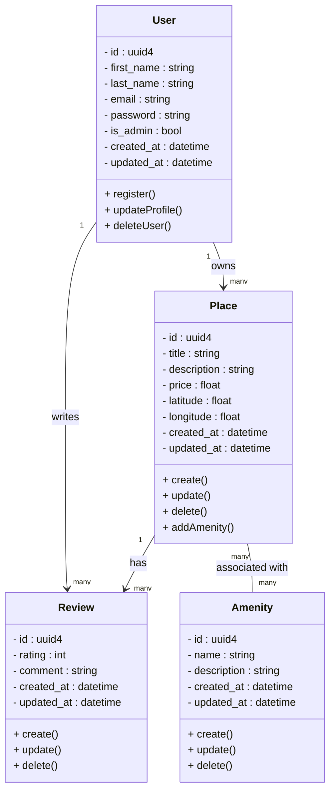

```mermaid
classDiagram
    class User {
        - id : uuid4
        - first_name : string
        - last_name : string
        - email : string
        - password : string
        - is_admin : bool
        - created_at : datetime
        - updated_at : datetime
        + register()
        + updateProfile()
        + deleteUser()
    }

    class Place {
        - id : uuid4
        - title : string
        - description : string
        - price : float
        - latitude : float
        - longitude : float
        - created_at : datetime
        - updated_at : datetime
        + create()
        + update()
        + delete()
        + addAmenity()
    }

    class Review {
        - id : uuid4
        - rating : int
        - comment : string
        - created_at : datetime
        - updated_at : datetime
        + create()
        + update()
        + delete()
    }

    class Amenity {
        - id : uuid4
        - name : string
        - description : string
        - created_at : datetime
        - updated_at : datetime
        + create()
        + update()
        + delete()
    }

    User "1" --> "many" Place : owns
    Place "1" --> "many" Review : has
    User "1" --> "many" Review : writes
    Place "many" -- "many" Amenity : associated with

```