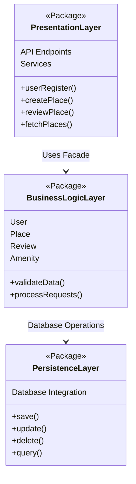
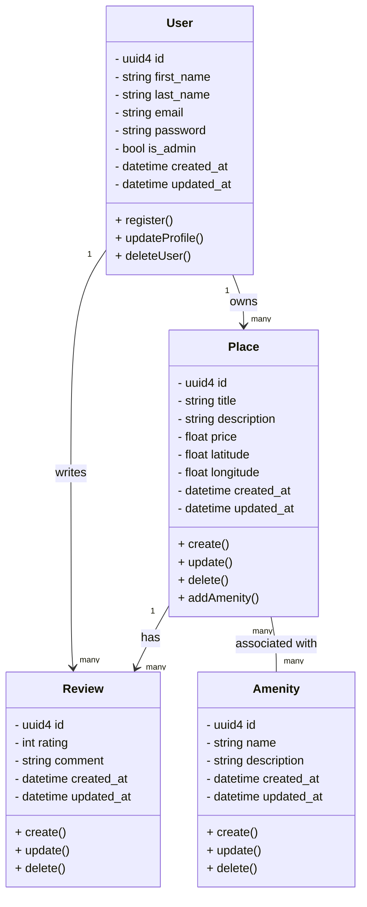
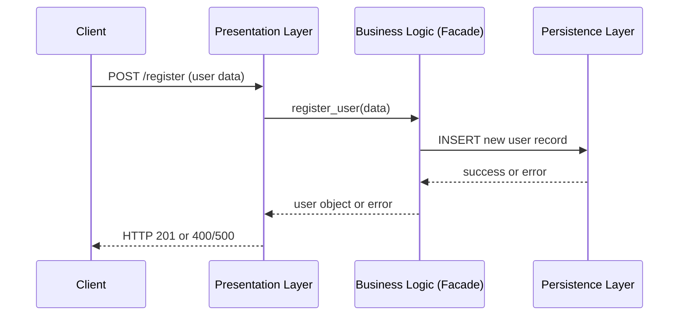
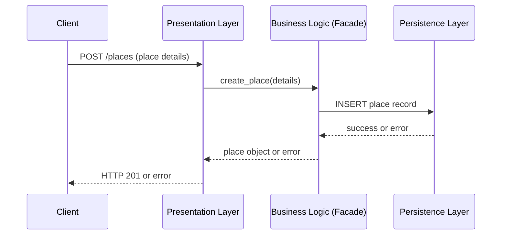
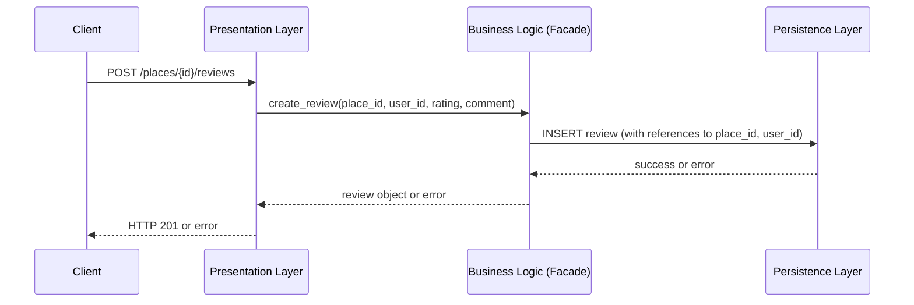
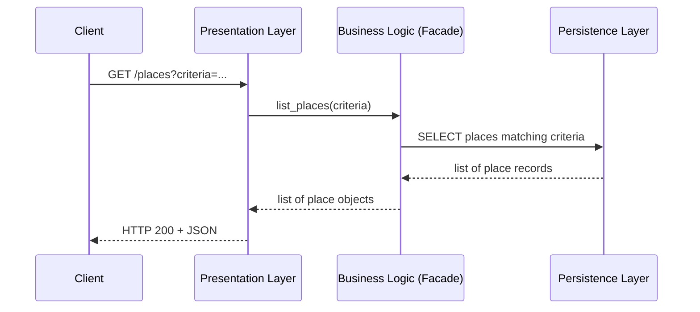

```markdown
# Documentation Compilation

## Table of Contents
1. [Introduction](#introduction)  
2. [High-Level Diagram](#high-level-diagram)  
3. [Business Logic Diagram](#business-logic-diagram)  
4. [Sequence Diagrams](#sequence-diagrams)  
   1. [User Registration](#1-user-registration)  
   2. [Place Creation](#2-place-creation)  
   3. [Review Submission](#3-review-submission)  
   4. [Fetching a List of Places](#4-fetching-a-list-of-places)  
5. [Conclusion](#conclusion)

---

## Introduction

This document **combines all UML diagrams** required by the **HBnB - UML** project:
- **High-Level Package Diagram** (3-layer approach + Facade)  
- **Detailed Class Diagram** (business logic for `User`, `Place`, `Review`, `Amenity`)  
- **Sequence Diagrams** (user registration, place creation, review submission, listing places)

---

## High-Level Diagram

Below is the **raw code** for the **high-level package diagram**. Copy/paste into a Mermaid-capable Markdown viewer or use an online Mermaid editor.

```markdown
# High-Level Package Diagram


```

### Explanation
- **PresentationLayer**: Handles routes, services, and user interactions.  
- **BusinessLogicLayer**: Houses core domain logic and provides a facade for simpler calls.  
- **PersistenceLayer**: Performs database operations (save, update, delete, query).

---

## Business Logic Diagram

Below is the **raw code** for the **business logic class diagram** showing the main entities.

```markdown
# Business Logic Diagram


```

### Notes
- **User**: Unique ID, timestamps, plus `is_admin` for privileges.  
- **Place**: Tied to a `User` as its owner, can have multiple `Amenities`.  
- **Review**: Associated with a single `User` and `Place`.  
- **Amenity**: Many-to-many with `Place`.

---

## Sequence Diagrams

Below are **four** sequence diagrams covering key API workflows: **User Registration**, **Place Creation**, **Review Submission**, and **Fetching Places**.

### 1. User Registration

```markdown
# sequence_diagram_register.md


```

### 2. Place Creation

```markdown
# sequence_diagram_place.md


```

### 3. Review Submission

```markdown
# sequence_diagram_review.md


```

### 4. Fetching a List of Places

```markdown
# sequence_diagram_fetch.md


```

---

## Conclusion

All diagrams are **now compiled** into this single file for easy reference. They outline:

1. A **3-Layer Architecture** (Presentation, Business Logic, Persistence) with a Facade.  
2. **Entities** and **relationships** (`User`, `Place`, `Review`, `Amenity`).  
3. **Workflow** for typical API interactions (user registration, place creation, reviews, and fetching places).

These UML artifacts serve as the **blueprint** for the HBnB application’s structure and data flows, guiding both future implementation and documentation.
