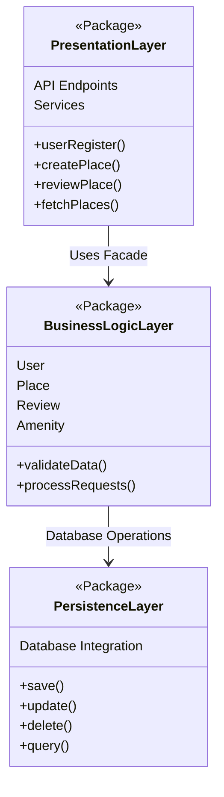

```mermaid
classDiagram
    class PresentationLayer {
        <<Package>>
        API Endpoints
        Services
        +userRegister()
        +createPlace()
        +reviewPlace()
        +fetchPlaces()
    }

    PresentationLayer --> BusinessLogicLayer : Uses Facade

    class BusinessLogicLayer {
        <<Package>>
        User
        Place
        Review
        Amenity
        +validateData()
        +processRequests()
    }

    BusinessLogicLayer --> PersistenceLayer : Database Operations

    class PersistenceLayer {
        <<Package>>
        Database Integration
        +save()
        +update()
        +delete()
        +query()
    }
```