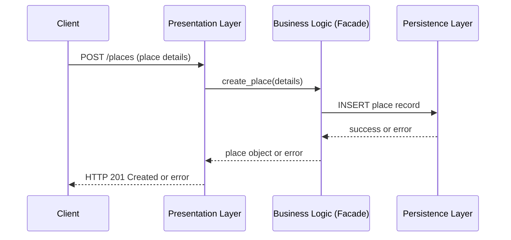

```mermaid
sequenceDiagram
    participant Client
    participant API as Presentation Layer
    participant Facade as Business Logic (Facade)
    participant DB as Persistence Layer

    Client->>API: POST /places (place details)
    API->>Facade: create_place(details)
    Facade->>DB: INSERT place record
    DB-->>Facade: success or error
    Facade-->>API: place object or error
    API-->>Client: HTTP 201 Created or error

```