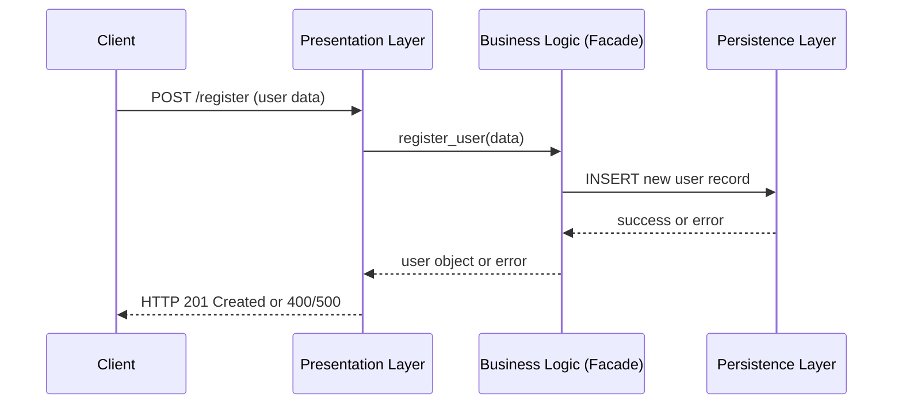

```mermaid
sequenceDiagram
    participant Client
    participant API as Presentation Layer
    participant Facade as Business Logic (Facade)
    participant DB as Persistence Layer

    Client->>API: POST /register (user data)
    API->>Facade: register_user(data)
    Facade->>DB: INSERT new user record
    DB-->>Facade: success or error
    Facade-->>API: user object or error
    API-->>Client: HTTP 201 Created or 400/500

```