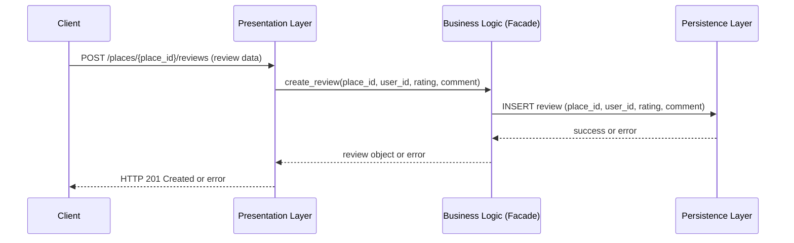

```mermaid
sequenceDiagram
    participant Client
    participant API as Presentation Layer
    participant Facade as Business Logic (Facade)
    participant DB as Persistence Layer

    Client->>API: POST /places/{place_id}/reviews (review data)
    API->>Facade: create_review(place_id, user_id, rating, comment)
    Facade->>DB: INSERT review (place_id, user_id, rating, comment)
    DB-->>Facade: success or error
    Facade-->>API: review object or error
    API-->>Client: HTTP 201 Created or error

```